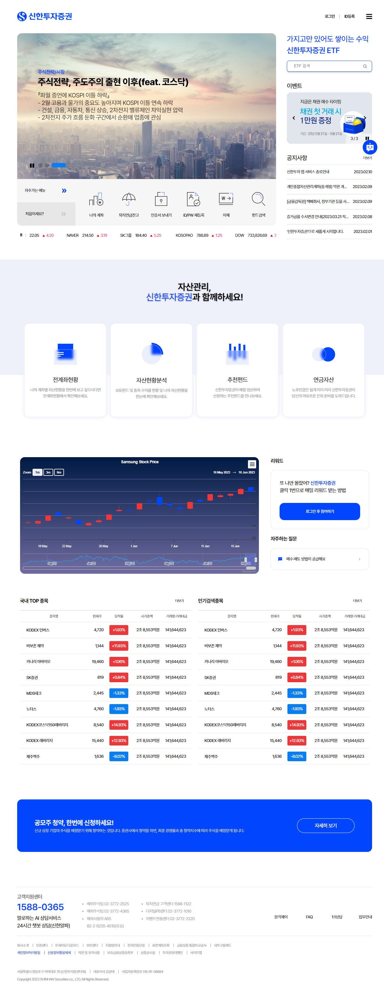
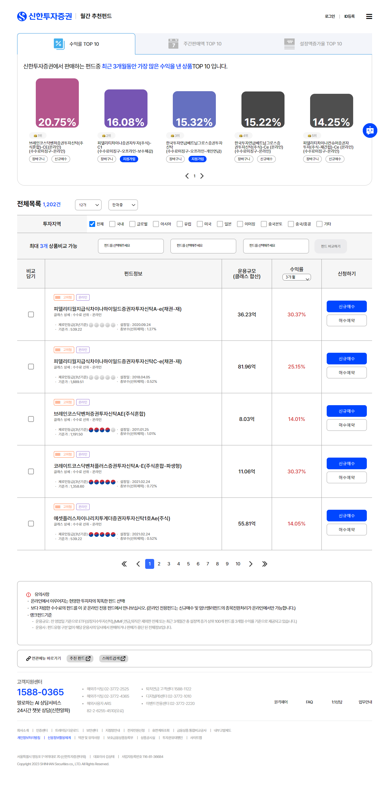
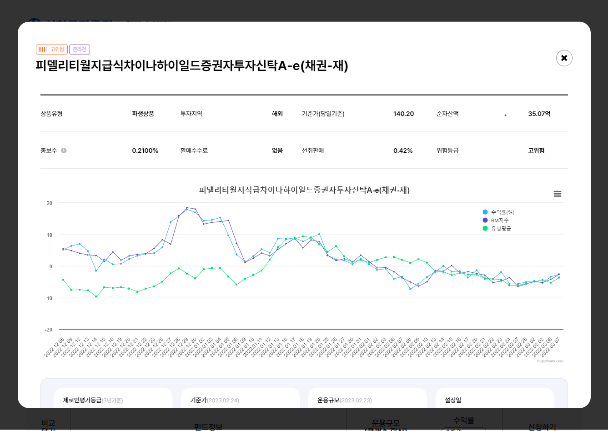
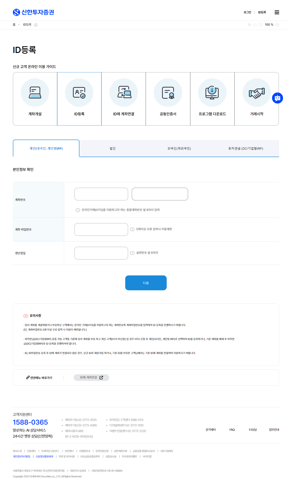
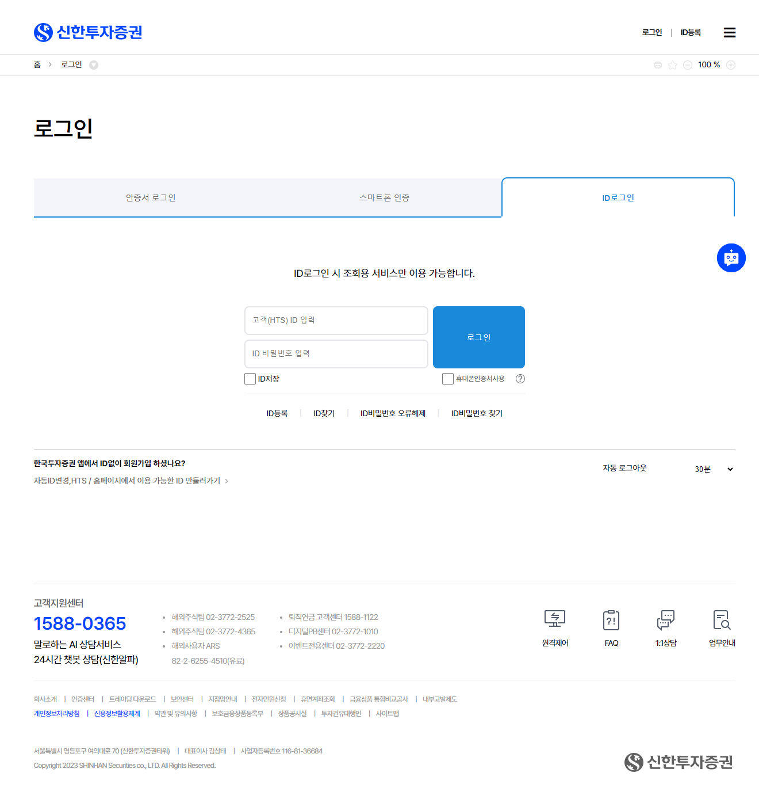

# Shinhan-Investment-Corp_citeRemake
- 분류 : 팀프로젝트
- 작업기간 : 2023.02.20 ~ 2023.03.29
- 리뉴얼 사이트 주소 : https://www.shinhansec.com/
- 사용된 라이브러리
    - 제이쿼리
    - highcarts.com : https://www.highcharts.com/
    - swiper : https://swiperjs.com/
---
## 설명
신한투자증권 페이지를 리뉴얼해보았습니다. 작업기간은 총 한달가령 걸렸습니다.

저희가 작업한 페이지는 메인 페이지와 펀드 랭킹 페이지, 펀드 상세 페이지, 로그인 페이지, 회원가입 페이지로 총 5페이지를 작업했습니다.
사용한 라이브러리로는 제이쿼리와 하이차트, swiper를 사용했습니다. 

제가 작업한 페이지는 index 페이지입니다. 

## 스크린샷
- index 페이지
    
- fund_ranking 페이지
    
- contents 페이지
    
- join 페이지
    
- login 페이지
    

